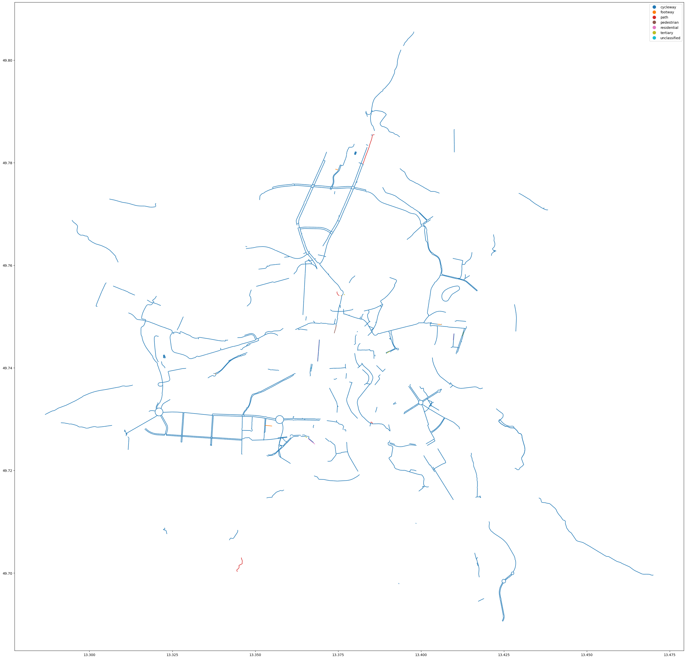

Scripts and notebooks for [CycloRank](https://mlumiste.com//projects/cyclorank/) project.
All credits to [Mihkel Lumiste](https://mlumiste.com/) [github](https://github.com/skandium) for the original code.

Current update aims to provide this cycling infrastructure ranking tool for Czechia for all cities above 10000 inhabitants and 
for every year. 

Maintained by [AutoMAT](https://automat.cz/), [Městem na kole](https://mestemnakole.cz) 
and [Daniel Soutner](https://daniel.soutner.cz/).  




## 0. Installation

```shell
sudo apt install osmium-tool
pip install osmium
```


## 1. Run

## 1.1 Simple run

First downloading and processing script (for Czechia is about 2hrs):
```shell
./_run_cyklorank_v1.sh
```
And then utilize the notebook to generate the table and plots.

## 1.2 Step by step

### Get maps and data

Get maps and extract cities. 
First, update desired cities in `city_conf.py` and then run:

```shell
mkdir extracted_maps
python download_and_extract_maps_cli.py
```

Get city polygons
```shell
mkdir city_polygons
python get_city_polygons_cli.py
python routing/sample_coordinates.py
```

### Distances

set `decay=False` in `get_osmium_data.py`
and get distances for all cities
```shell
python get_osmium_data_cli.py extracted_maps/Vienna.pbf Vienna

# for all cities
for i in extracted_maps/*.pbf; do
    city=$(basename $i .pbf)
    echo $city
    python get_osmium_data_cli.py $i $city
done
```

then
```shell
python get_decay_configs_cli.py
```

### Final results

```shell
python run_map_analysis_cli.py
```